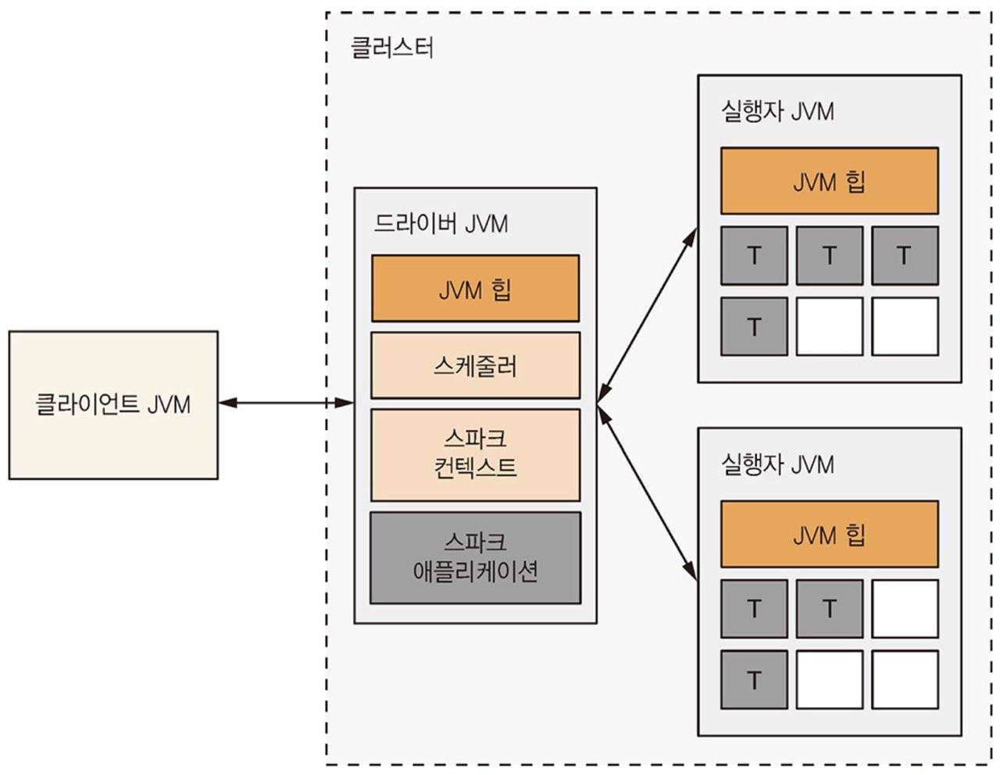
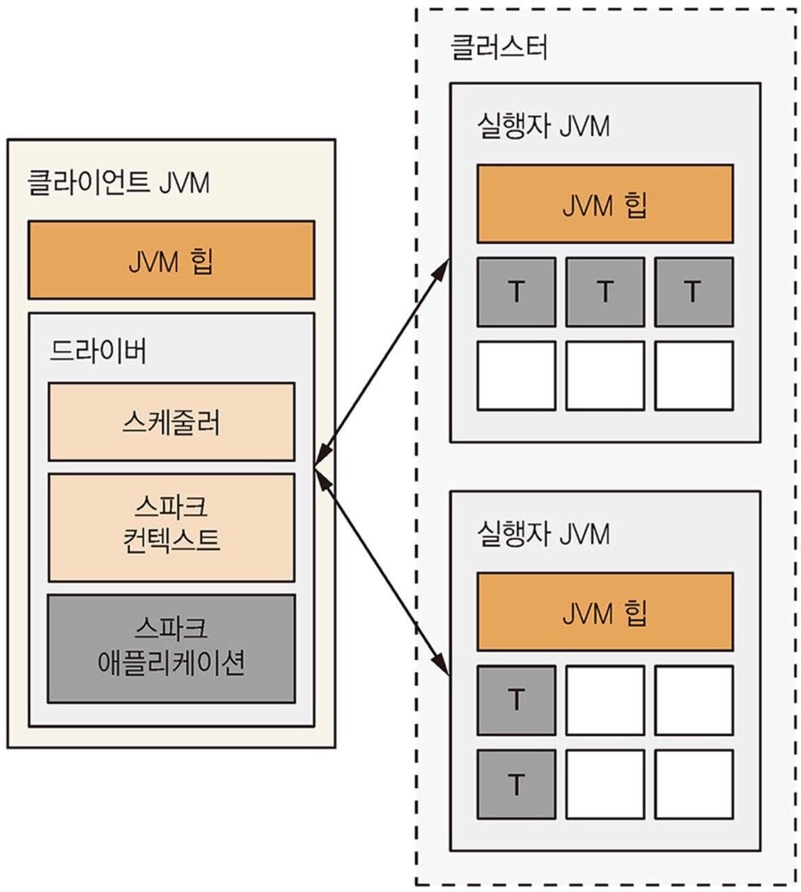
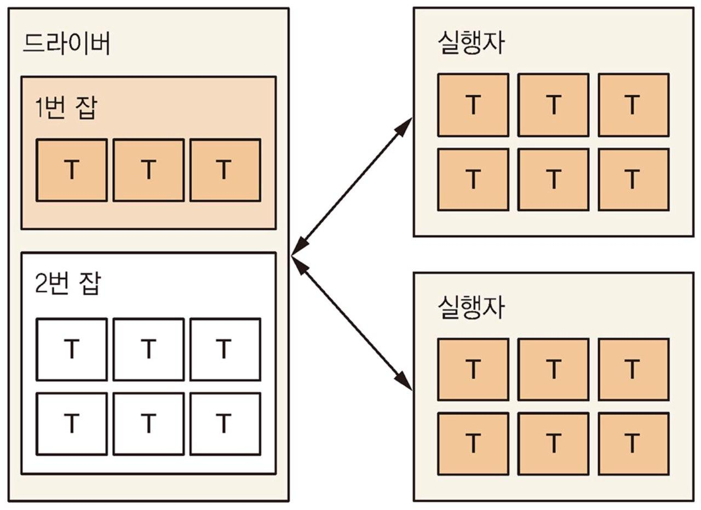
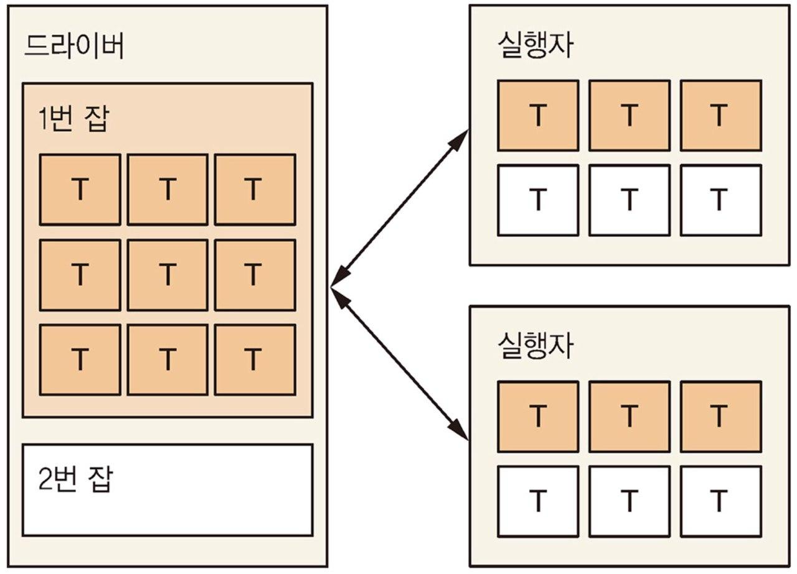
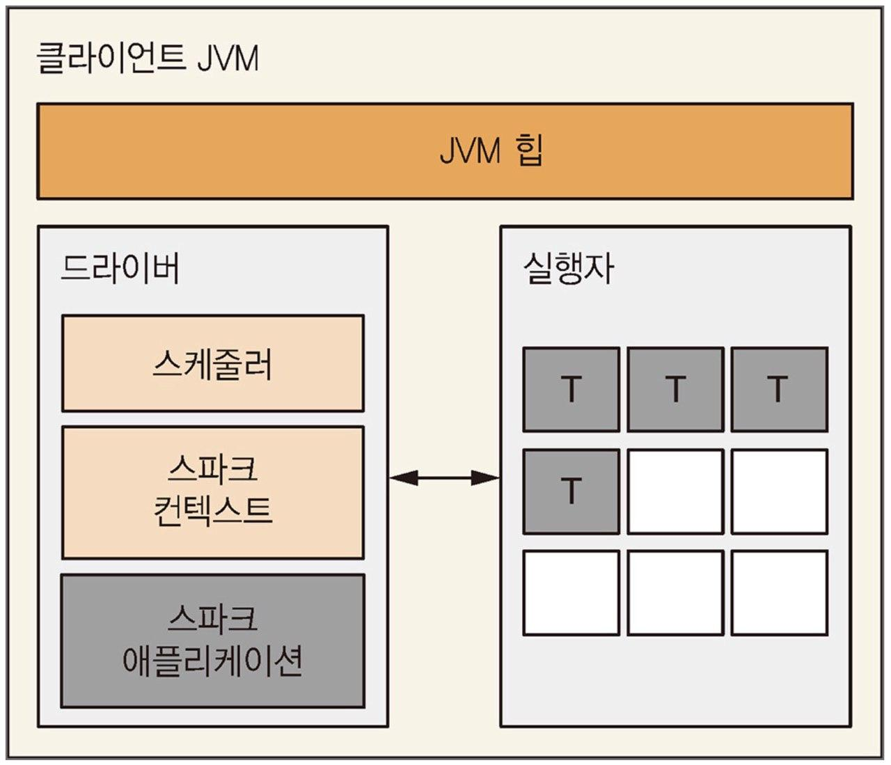

# 10장 스파크 클러스터 구동

* 스파크 클러스터를 구축하고 사용하는 방법을 설명
* 스파크 클러스터는 _복수의 머신에서 분산된 방식으로 실행되는 프로세스들의 연결된 집합_ 으로 볼 수 있음

이 장에서 배우는 것

* 클러스터의 유형
  * YARN
  * MESOS
  * 스파크 자체 클러스터
  * 스파크 로컬 모드도 가능 \(+로컬 클러스터 모드\)
    * 주로 테스트 용도로 사용
    * 로컬 모드: 단일 머신에서 실행되는 일종의 가상 클러스터
    * 로컬 클러스터 모드: 단일 머신에서 제한적으로 실행되는 스파크 자체 클러스터
* 모든 클러스터 유형에 통용되는 스파크 런타임 아키텍처의 컴포넌트
  * 스파크 컨텍스트 및 스케쥴러
  * 드라이버 프로세스, 실행자 프로세스
  * 잡 및 리소스 스케쥴링
  * 스파크 웹 UI \(스파크 잡을 모니터링하는 데 활용\)
* 스파크 런타임 인스턴스의 설정 방법\(모든 클러스터 유형에서 거의 유사\)

## 10.1 스파크 런타임 아키텍처의 개요

다양한 스파크 클러스터 유형의 세세한 특성 대신 모든 유형에서 공통으로 사용하는 컴포넌트를 설명

### 10.1.1 스파크 런타임 컴포넌트

스파크 런타임 컴포넌트를 잘 알아두면 스파크 잡이 어떻게 작동하는지 이해하는 데 도움이 됨

* client
* driver
* executor

드라이버 프로세스와 실행자 프로세스의 실제 물리적 위치는 클러스터 요형과 설정에 따라 다르다. 같은 머신일 수도 있고 다른 머신일 수도 있음

#### 10.1.1.1 클라이언트 프로세스의 역할

* 아래와 같은 드라이버 프로그램들을 시작
  * spark-submit 스크립트
  * spark-shell 스크립트
  * 스파크 API를 사용한 커스텀 애플리케이션
* 스파크 애플리케이션에 필요한 classpath와 모든 설정 옵션 준비
* 주어진 애플리케이션 인수 값을 드라이버에서 실행될 스파크 애플리케이션에 전달

#### 10.1.1.2 드라이버의 역할

* 스파크 애플리케이션의 실행을 관장하고 모니터링
* 하나의 스파크 애플리케이션에는 드라이버가 _오직 하나만_ 존재
* 스파크 애플리케이션을 감싸는 일종의 래퍼 역할을 한다고도 볼 수 있음
* 드라이버와 그 하위 컴포넌트\(스파크 컨텍스트와 스케쥴러\)의 담당 역할
  * 클러스터 매니저에 메모리 및 CPU 리소스 요청
  * 애플리케이션 로직을 스테이지와 태스크로 분할\(4장 참고\)
  * 여러 실행자에 태스크를 전달
  * 태스크 실행 결과를 수집

드라이버 프로그램의 실행 방법 두 가지

* 클러스터 배포 모드\(cluster-deploy mode\): 드라이버 프로세스를 _클러스터 내부에서 별도의 JVM 프로세스로 실행_, 드라이버 프로세스의 리소스(주로 JVM 힙 메모리)를 클러스터가 관리
  
* 클라이언트 배포 모드\(client-deploy mode\): 드라이버를 _클라이언트의 JVM 프로세스에서 실행_, 클러스터가 관리하는 실행자들과 통신
  

배포 모드에 따라 스파크를 설정하는 방법과 클라이언트 JVM에 필요한 리소스 요구량이 달라질 수 있다.

#### 10.1.1.3 실행자의 역할

* 드라이버가 요청한 태스크들을 받아서 실행하고, 그 결과를 드라이버로 반환하는 JVM 프로세스
* 태스크들은 자신이 가진 여러 태스크 슬롯에서 병렬로 실행
* 일반적으로 태스크 슬롯 개수는 CPU 코어 개수의 두세 배 정도로 설정
* 간혹 태스크 슬롯을 CPU 코어라고 지칭하는 경우도 있는데, 엄밀히 말해 태스크 슬롯은 스레드로 구현되므로 머신의 CPU 코어 개수와 반드시 일치할 필요는 없음

#### 10.1.1.4 스파크 컨텍스트의 생성

* 드라이버는 `SparkContext` 인스턴스를 생성하고 시작
  * 스파크 REPL 셸은 드라이버 프로그램 역할을 하면서 미리 설정된 `SparkContext`를 `sc`라는 변수로 제공
  * JAR 파일을 제출하거나 스파크 API로 스파크 독립형 애플리케이션을 실행할 때는 직접 스파크 컨텍스트를 생성해야 함
* `SparkContext`는 JVM당 하나만 생성 가능
  * `spark.driver.allowMultipleContexts`라는 옵션이 있긴 하지만 여러 개의 `SparkContext` 사용은 권장하지 않음
* `SparkContext`는 RDD를 생성하거나 데이터를 로드하는 등 다양한 작업을 수행하는 여러 유용한 메서드를 제공하며, 스파크 런타임 인스턴스에 접근할 수 있는 기본 인터페이스

### 10.1.2 스파크 클러스터 유형

스파크 클러스터 유형마다 고유의 특징과 장단이 있으므로 환경과 활용 사례에 적합한 클러스터를 사용해야 함

#### 10.1.2.1 스파크 자체 클러스터

* 스파크 전용 클러스터로 오직 스파크 애플리케이션에만 적합하도록 설계됨
  * Kerberos 인증 프로토콜로 보호된 HDFS 지원 X
* 잡 시작에 걸리는 시간이 YARN보다 짧음

#### 10.1.2.2 YARN 클러스터

* YARN은 하둡의 리소스 매니저 및 작업 실행 시스템
  * 하둡 버전1의 맵리듀스\(MapReduce\) 엔진을 대체한 것으로 맵리듀스 버전2라고도 부름
* YARN을 사용했을 때의 장점
  * 이미 대규모로 YARN 클러스터를 운영하는 조직이 많음
  * 스파크 뿐만 아니라 다양한 유형의 자바 애플리케이션 실행 가능
    * 즉, 기존 레거시 하둡과 스파크 애플리케이션을 손쉽게 통합 가능
  * 서로 다른 사용자 및 조직의 애플리케이션을 격리하고 우선순위 조정 가능
  * Kerberos를 기반으로 하는 보안 HDFS는 오직 YARN에서만 지원
  * 스파크를 클러스터의 모든 노드에 설치할 필요 X

#### 10.1.2.3. 메소스 클러스터

* 확장성과 장애 내성을 갖춘 C++ 기반 분산 시스템 커널
* 2단계 스케줄링 아키텍처로 구성되어서 _스케줄러 프레임워크의 스케줄러_ 라고도 부름
* 메소스를 사용했을 때의 장점
  * YARN과 달리 C++과 파이썬 애플리케이션을 지원
  * YARN이나 스파크 자체 클러스터는 메모리 리소스만 스케줄링할 수 있지만 메소스는 CPU, 디스크 ㄷ공간, 네트워크 포트 등 다양한 유형의 리소스 스케줄링 가능
  * 다른 클러스터에서 지원하지 않는 다양한 추가 옵션 제공
* YARN과 메소스 중 어떤 것이 더 나은지에 대해서는 논쟁이 있음
  * [Myriad](http://myriad.incubator.apache.org/)를 사용하면 YARN을 메소스 프레임워크 형태로 실행해서 딜레마 해결!

#### 10.1.2.4 스파크 로컬 모드

* 단일 머신에서 실행하는 독특한 형태의 스파크 자체 클러스터
* 쉽고 빠르게 구축하고 테스트하기엔 좋지만 운영 환경으로는 No
* 태스크 부하를 분산하지 않으므로 리소스가 단일 머신으로 제한됨 성능 저하

## 10.2 잡 스케줄링과 리소스 스케줄링

* 스파크 애플리케이션의 리소스 스케줄링 순서
  1. 실행자\(JVM 프로세스\)와 CPU\(태스크 슬롯\) 리소스를 스케줄링
  2. 각 실행자에 메모리 리소스 할당
* 클러스터 매니저와 스파크 스케줄러는 _스파크 잡을 실행하는 데 필요한 리소스를 부여_
  * 클러스터 매니저
    * 드라이버가 요청한 실행자 프로세스 시작
    * 클러스터 배포 모드에서 애플리케이션을 실행할 때는 드라이버 프로세스를 시작하는 역할도 담당
    * 실행 중인 프로세스를 중지하거나 재시작
    * 실행자 프로세스가 사용할 수 있는 최대 CPU 코어 개수 제한
    * 클러스터 매니저가 각 스파크 애플리케이션에 할당한 실행자들은 다른 애플리케이션과 공유되지 않음
      * 여러 스파크 애플리케이션\(및 기타 다른 유형의 애플리케이션\)을 한 클러스터에서 동시에 실행하면 애플리케이션들은 _클러스터의 리소스를 두고 경쟁_
  * 잡 스케줄링(Job scheduling)
    * 드라이버와 실행자가 시작되면 스파크 스케줄러가 이들과 직접 통신하면서 _어떤 실행자가 어떤 태스크를 수행할지 결정하는 과정_
    * 클러스터의 CPU 리소스 사용량을 좌우
      * 단일 JVM에서 실행하는 태스크가 많을수록 힙 메모리를 더 사용하므로 메모리 사용량에도 간접적으로 영향을 줌
* 스파크는 CPU 리소스와 달리 메모리 리소스는 태스크 단위로 관리하지 않음
  * 클러스터가 할당한 JVM 힙 메모리를 여러 세그먼트로 분리해 관리

즉, 스파크 애플리케이션의 리소스 스케줄링은 다음 두 가지 레벨로 이루어짐

* 클러스터 리소스 스케줄링: 여러 스파크 애플리케이션 실행자에 리소스 할당
* 스파크 리소스 스케줄링: 단일 스파크 애플리케이션 내에서 태스크를 실행할 CPU 및 메모리 리소스 스케줄링

### 10.2.1 클러스터 리소스 스케줄링

단일 클러스터에서 실행하는 다수의 애플리케이션에 클러스터의 리소스를 나누어 주는 작업

* 클러스터 매니저가 담당
* 각 애플리케이션이 요청한 리소스를 제공하고, 애플리케이션 실행이 끝나면 할당했던 리소스를 다시 회수
  * 실행자에 CPU와 메모리 리소스를 할당
* 스파크가 지원하는 모든 클러스터 유형에서 대체로 유사\(세세한 차이점은 있음\)
  * 메소스 클러스터는 미세 스케줄러\(fine-grained scheduler\)라는 독특한 기능 제공
    * 애플리케이션 단위 대신 각 태스크 단위로 리소스 할당
    * 애플리케이션이 더 이상 사용하지 않는 리소스를 다른 애플리케이션에 할당 가능

### 10.2.2 스파크 잡 스케줄링

* 클러스터 리소스 스케줄링이 끝나면 스파크 애플리케이션 내부에서 잡 스케줄링이 진행
* 클러스터 매니저와 관계없이 스파크 자체에서 수행하는 작업
  * 스파크는 RDD 계보를 바탕으로 잡과 스테이지, 태스크 생성 \(4장 참조\)
  * 잡을 어떻게 태스크로 분할하고 어떤 실행자에 전달할지 결정하고 실행 경과를 모니터링
* 스파크에서는 여러 사용자\(또는 여러 스레드\)가 동일한 `SparkContext`를 동시에 사용 가능(thread-safe 보장)하므로, 동일한 `SparkContext`를 공유하는 여러 잡은 실행자의 리소스를 두고 서로 경쟁
* 스파크는 CPU 리소스를 분배하는 방식으로 선입선출 스케줄링\(First-In-First-Out scheduling, FIFO scheduling)과 공정 스케줄링\(fair scheduling\) 모드 지원
  * `spark.scheduler.mode`를 `FIFO`나 `FAIR`로 설정

#### 10.2.2.1 선입선출 스케줄러

* 가장 먼저 리소스를 요청한 잡이 모든 실행자의 태스크 슬롯을 필요한 만큼\(또는 남은 만큼\) 전부 차지
  * 선입선출 스케줄러는 각 잡이 단일 스테이지로 구성된다고 가정
  * 예를 들어 태스크 15개를 수행해야 하는 1번 잡과 태스크 6개를 수행해야 하는 2번 잡이 있고, 태스크 슬롯을 각각 6개씩 가진 실행자가 2개 있다고 하자. 그렇다면 1번 잡이 12개의 태스크 슬롯을 모두 차지하고, 2번 잡은 6개의 태스크 슬롯만 필요하지만 1번 잡이 끝날 때까지 대기
* 스파크의 기본 스케줄링 모드로 한 번에 잡 하나만 실행하는 단일 사용자 애플리케이션에 적합



#### 10.2.2.2 공정 스케줄러

* 실행자 리소스\(즉, 실행자의 스레드\)를 놓고 경쟁하는 스파크 잡들에 라운드 로빈\(Round Robin\) 방식으로 균등하게 리소스 배분
  * 선입선출 스케줄러의 예시와 같은 상황이라면 이 두 잡의 태스크를 병렬로 실행. 즉, 1번 잡과 2번 잡은 각각 3개 씩의 태스크 슬롯을 각 실행자에서 차지
  * 실행 시간이 짧은 잡\(2번 잡\)이 태스크 슬롯을 더 늦게 요청했더라도 오래 걸리는 잡\(1번 잡\)을 완료할 때까지 기다리지 않고 바로 실행 가능
* 다중 사용자 애플리케이션이 복수의 잡을 동시에 실행하는 경우 효과적
* YARN의 큐\(12장 참조\)와 유사한 스케줄러 풀\(scheduler pool\) 기능 지원
  * 각 풀에는 가중치와 최소 지분 설정 가능
  * 가중치\(weight\): 특정 풀의 잡이 다른 풀의 잡에 비해 리소스를 더 많이 할당받을 비율을 지정
  * 최소 지분 값\(minimum share value\): 각 풀이 항상 사용할 수 있는 최소한의 CPU 코어 개수
  * `spark.scheduler.allocation.file` 매개변수에 XML 설정 파일을 지정해 설정



#### 10.2.2.3 태스크 예비 실행

* 태스크가 실행자들에 분배되는 방식을 예비 실행\(speculative execution\)이라는 개념으로 설정할 수 있음
* 예비 실행은 낙오\(straggler\) 태스크\(동일 스테이지의 다른 태스크보다 더 오래 걸리는 태스크\) 문제 해결 가능
  * 다른 프로세스가 일부 실행자 프로세스의 CPU 리소스를 모두 점유하면 해당 실행자는 태스크를 제시간에 완수하지 못할 수 있음
  * 예비 실행 기능을 사용하면 이런 경우 스파크가 해당 파티션 데이터를 처리하는 _동일한 태스크를 다른 실행자에도 요청_
  * 기존 태스크가 지연되고 예비 태스크가 완료되면 스파크는 기존 태스크의 결과 대신 예비 태스크의 결과를 사용
  * 일부 실행자의 오작동이 전체 잡의 지연으로 이어지지 않도록 방지
* 기본은 비활성화이며, `spark.speculation`을 `true`로 설정하면 사용 가능
* 예비 실행을 활성화하면 스파크는 `spark.speculation.interval`에 지정된 시간 간격마다 어떤 예비 태스크를 시작해야 할지 체크\(기본 값: 100밀리초\)
* 예비 태스크를 시작하는 기준을 별도의 매개변수로 설정 가능
  * `spark.speculation.quantile`: 스테이지가 예비 실행을 고려하기 전에 완료해야 할 태스크 진척률 지정\(기본 값: 0.75\)
  * `spark.speculation.multiplier`: 기존 태스크가 어느 정도 지연되어야 예비 태스크를 시작할지 지정\(기본 값: 1.5\)
* 일부 작업에는 예비 실행을 사용하는 것이 적절하지 않음
  * 관계형 데이터베이스와 같은 외부 시스템에 데이터를 내보내는 작업에 예비 실행을 적용하면 두 태스크가 동일 파티션의 동일 데이터를 중복 기록하는 문제 발생 가능
  * 애플리케이션에 영향을 미치는 모든 스파크 설정을 제어할 수 있는 전체 권한이 없을 때는 예비 실행을 사용하지 않는 편이 좋음

### 10.2.3 데이터 지역성

* 데이터 지역성(data locality): 스파크가 _데이터와 최대한 가까운 위치에서 태스크를 실행하려고_ 노력하는 것
  * 이런 특성은 결국 태스크를 실행할 실행자를 선택하는 잡 스케줄링으로 연결
* 스파크는 각 파티션 별로 선호 위치(preferred location) 목록을 유지
  * 선호 위치: 파티션 데이터를 저장한 호스트네임 또는 실행자 목록으로 이 위치를 참고해 데이터와 가까운 곳에서 연산 실행 가능
  * HDFS 데이터로 생성한 RDD(HadoopRDD)와 캐시된 RDD에서 사용할 때만 선호 위치 정보를 알아낼 수 있음
    * HDFS 데이터로 생성된 RDD: 하둡 API를 통해 HDFS 클러스터에서 위치 정보를 가져옴
    * 캐시된 RDD: 스파크가 각 파티션이 캐시된 실행자 위치를 직접 관리
* 데이터 지역성의 5가지 레벨
  * `PROCESS_LOCAL`: 파티션을 캐시한 실행자가 태스크를 실행
  * `NODE_LOCAL`: 파티션에 직접 접근할 수 있는 노드에서 태스크를 실행
  * `RACK_LOCAL`: 클러스터의 랙(rack) 정보를 참고할 수 있을 때(현재는 YARN에서만 가능) 파티션이 위치한 랙에서 태스크 실행
  * `NO_PREF`: 태스크와 관련해 선호하는 위치가 없음
  * `ANY`: 데이터 지역성을 확보하지 못했을 때는 다른 위치에서 태스크 실행
* 스파크 스케줄러는 파티션 데이터를 실제로 저장한 실행자가 관련 태스크를 실행하도록 최대한 노력하고, 데이터 전송을 최소화
  * 데이터 지역성의 실현 여부가 성능에 큰 영향을 미칠 수 있음
  * 각 태스크에서 최선의 지역성 레벨을 만족하는 태스크 슬롯을 확보하지 못한 경우(이미 사용중인 경우) 일정 시간을 기다리다 차선의 지역성 레벨로 넘어가 다시 스케줄링 시도
    * `spark.locality.wait` 매개 변수로 기다리는 시간 지정 가능 - 기본 값: 30초
    * `spark.locality.wait.process`, `spark.locality.wait.node`, `spark.locality.wait.rack`을 각각 지정해 특정 레벨의 대기 시간 설정 가능 - 대기 시간을 0으로 설정하면 해당 레벨은 무시
* 특정 태스크의 지역성 레벨은 스파크 웹 UI Stage Details 페이지에 있는 Tasks 테이블의 Locality Level 칼럼에 표시됨

### 10.2.4 스파크의 메모리 스케줄링

* 여태까지 알아본 것은 스파크가 어떻게 CPU 리소스를 스케줄링하는가였음
* 스파크의 메모리 리소스 스케줄링
  * 스파크 실행자 JVM 프로세스의 메모리는 클러스터 매니저가 할당(클러스터 배포 모드면 드라이버의 메모리도 할당)
  * 각 프로세스에 메모리를 할당하면 스파크가 잡과 태스크가 사용할 메모리 리소스를 스케줄링하고 관리

#### 10.2.4.1 클러스터 매니저가 관리하는 메모리

* `spark.executor.memory` 설정값으로 실행자에 할당할 메모리양 설정(변수 값 뒤에 `g`나 `m`를 붙여 단위 지정 가능)
  * 스파크 버전 1.5.0부터는 `1g`가 기본값

#### 10.2.4.2 스파크가 관리하는 메모리

* 스파크 실행자는 할당된 메모리 중 일부를 나누어 각각 캐시 데이터와 임시 셔플링 데이터를 저장하는 데 사용
  * 캐시 데이터
    * `spark.storage.memoryFraction` 매개변수로 설정 (기본 값: 0.6)
    * `spark.storage.safetyFraction`: 스파크가 메모리 사용량을 측정하고 제한하기 전에 사용량이 설정 값을 초과할 수 있으므로 설정하는 안전 매개 변수(기본값 0.9)
  * 임시 셔플링 데이터
    * `spark.shuffle.memoryFraction` 매개변수로 설정 (기본 값: 0.2)
    * `spark.shuffle.safetyFraction`: 스파크가 메모리 사용량을 측정하고 제한하기 전에 사용량이 설정 값을 초과할 수 있으므로 설정하는 안전 매개 변수(기본값 0.8)
* 기본값일 때 캐시 데이터와 임시 셔플링 데이터가 사용하는 힙 메모리의 비율은 각각 54%, 16%이고 남은 메모리 30%는 태스크를 실행하는 데 필요한 기타 자바 객체와 리소스를 저장하는 데 사용(실제로는 20%만 사용 가능)
* 셔플링 메모리 영역과 캐시 스토리지 메모리 영역이 분리되어서 메모리를 충분히 활용할 수 없다는 문제가 있음
* 스파크 1.6.0 부터는 실행 메모리 영역과 스토리지 메모리 영역을 통합해 관리(셔플링을 하지 않는 작업이면 전체 메모리를 캐시가 차지할 수 있음 - vice versa)
  * 기존의 `spark.storage.memoryFraction`과 `spark.shuffle.memoryFraction` 매개변수는 사용 불가 (`spark.memory.useLegacyMode`를 `true`로 설정하면 가능)
  * `spark.memory.fraction`: JVM 힙 메모리 중 실행 메모리와 스토리지 메모리에 사용할 비율 지정 (기본 값: 0.6) 남은 영역(0.4)은 사용자 데이터 구조와 스파크 내부 메타데이터 등을 저장하는 데 활용
  * `spark.memory.storageFraction`: `spark.memory.fraction`으로 설정한 영역 중 스토리지 메모리 영역으로 보존할 영역 비율 지정 (기본 값: 0.5) 이렇게 일단 스토리지 메모리로 할당된 일정 크기의 영역은 실행 메모리가 더 필요해도 비우지 않음

#### 10.2.4.3 드라이버 메모리 설정

* `spark.driver.memory` 매개변수로 드라이버 메모리 리소스 설정
* spark-shell이나 spark-submit 스크립트로 애플리케이션을 시작할 때 적용
* 외부 애플리케이션에서 코드로 스파크 컨텍스트를 동적으로 생성할 때(즉, 클라이언트 모드)는 드라이버가 외부 애플리케이션의 메모리 중 일부를 사용. 즉, 드라이버 메모리 공간을 늘리려면 `-Xmx` 옵션을 사용해 애플리케이션 프로세스에 할당할 자바 힙의 최대 크기를 늘려야 함

## 10.3 스파크 설정

* 스파크 애플리케이션의 실행에 관련된 여러 설정 값은 스파크 환경 매개변수로 지정
* 스파크 환경 매개변수는 다양한 방식으로 설정 가능
  * 명령줄에 매개변수를 덧붙이거나
  * 시스템 환경 변수처럼 스파크 환경 설정 파일을 작성하거나
  * 사용자 프로그램에서 설정 함수를 호출할 수도 있음
* 어떤 방식으로 설정하든 환경 매개변수 값은 `SparkContext`의 `SparkConf` 객체에 저장됨

### 10.3.1 스파크 환경 설정 파일

* 스파크 환경 매개변수의 기본 값은 `SPARK_HOME/conf/spark-defaults.conf` 파일에 지정
* 별도의 환경 설정 파일을 사용하려면 `--properties-file` 명령줄 매개변수로 파일 경로를 변경해야 함

### 10.3.2 명령줄 매개변수

* 명령줄 매개변수를 사용해 spark-shelldㅣ나 spark-submit 명령에 인수를 지정하고 애플리케이션을 설정할 수 있음
* 명령줄 매개변수로 지정된 값은 REPL 셸(spark-shell)이나 스파크 프로그램(spark-submit)의 `SparkConf` 객체에 전달됨
* 환경 설정 파일로 설정한 값보다 명령줄 매개변수로 지정한 값이 우선
* 모든 환경 매개변수 중 일부만 명령줄 매개변수로 지정할 수 있음
* 명령줄 매개변수와 환경 설정 파일의 매개변수는 동일 변수라도 이름이 다름
  * `--conf`를 사용하면 명령줄에서 환경 설정 파일과 동일한 이름으로 매개변수 설정 가능(여러 개 지정하려면 지정할 때마다 같이 사용해야 함)

  ```bash
  spark-shell --driver-memory 16g
  spark-shell --conf spark.driver.memory=16g
  ```

### 10.3.3 시스템 환경 변수

* 환경 매개변수 중 일부는 `SPARK_HOME/conf` 디렉터리 아래에 있는 spark-env.sh 파일로 지정 가능
  * 이 매개변수들의 기본 값은 OS 환경변수를 사용해 설정할 수도 있음
* 시스템 환경 변수로 설정한 값은 모든 설정 방식 중 가장 낮은 우선 순위
* spark-env.sh 파일은 스파크가 예제로 제공하는 spark-env.sh.template 파일을 이용해 쉽게 작성 가능
* 스파크 자체 클러스터의 spark-env.sh 파일을 변경했다면 모든 실행자가 동일한 환경 설정을 참고하도록 모든 워커 노드에 파일을 복사해야 함

### 10.3.4 프로그램 코드로 환경 설정

* `SparkConf` 클래스로 프로그램 내에서 직접 스파크 환경 매개변수를 설정할 수도 있음

  ```scala
  val conf = new org.apache.spark.SparkConf()
  conf.set("spark.driver.memory", "16g")
  val sc = new org.apache.spark.SparkContext(conf)
  ```

* 런타임에 환경 설정을 변경할 수는 없고, `SparkContext` 객체를 생성하기 _전에_ `SparkConf` 객체를 설정해야 함
  * `SparkContext`를 생성한 후에 매개변수를 설정하면 무시됨
* 프로그램 코드로 설정된 값은 모든 설정 방식 중 가장 우선 순위가 높음

### 10.3.5 `master` 매개 변수

* `master` 매개변수는 애플리케이션을 실행할 스파크 클러스터 유형을 지정
* spark-shell 또는 spark-submit 명령을 입력할 때 `--master` 매개 변수 전달 가능

```bash
spark-submit --master <master_connection_url>
```

* 애플리케이션 프로그램 내에서는 다음과 같이 지정 가능

```scala
val conf = org.apache.spark.SparkConf()
conf.set("spark.master", "<master_connection_url>")
```

* `SparkConf`의 `setMaster` 메서드 사용

```scala
conf.set("<master_connection_url>")
```

* `<master_connection_url>`은 클러스터 유형마다 다름 (10.5절, 11장, 12장 참조)
* JAR 파일 형태의 스파크 애플리케이션을 spark-submit으로 제출할 때 `master` 매개 변수를 프로그램 코드에서 설정하는 것은 비추
  * 애플리케이션의 이식성(portability)를 해침
  * spark-submit의 인수로 `master` 매개 변수를 지정하면 동일한 JAR 파일을 여러 클러스터에서 재사용 가능
  * 프로그램 내부에서 `--master` 매개 변수를 설정하는 것이 바람직한 경우는 스파크를 다른 기능 일부로 사용할 때 정도

### 10.3.6 설정된 매개변수 조회

* `sc.getConf.getAll` 메서드를 호출해 현재 스파크 컨텍스트에 명시적으로 정의 및 로드된 모든 환경 매개 변수 목록을 가져올 수 있음

```scala
scala> sc.getConf.getAll.foreach(x => println(x._1 + ": " + x._2))
spark.app.id: local-1524799343426
spark.driver.memory: 16g
spark.driver.host: <your_hostname>
spark.app.name: Spark shell
...
```

* 스파크 웹 UI의 Environment 페이지에서도 조회 가능

## 10.4 잡 스케줄링과 리소스 스케줄링

* 스파크는 `SparkContext`를 생성하면서 스파크 웹 UI도 시작
  * `spark.ui.enabled` 매개변수를 `false`로 설정해 비활성화 가능
  * 기본 포트는 4040이지만 `spark.ui.port` 매개변수로 변경 가능

### 10.4.1 Jobs 페이지

* 스파크 웹 UI의 시작 페이지는 현재 실행 중인 잡, 완료된 잡, 실패한 잡의 통계 정보 제공
  * 각 잡의 시작 시각과 실행 시간, 실행 완료된 스테이지 및 태스크 정보 확인 가능
* 각 잡의 Description 칼럼을 클릭하면 해당 잡의 완료된 스테이지와 실패한 스테이지 정보 확인 가능
  * 각 스테이지를 클릭하면 해당 스테이지의 세부 페이지로 이동
* Event Timeline 링크를 클릭하면 시간에 따른 잡 실행 기록을 시각화한 차트 확인 가능
  * 차트에 그려진 잡을 클릭하면 해당 잡의 세부 페이지로 이동
  * 이동한 페이지에서 완료된 스테이지와 실패한 스테이지 확인 가능

### 10.4.2 Stages 페이지

* Stages 페이지는 잡의 스테이지를 요약한 정보 제공
* 각 스테이지의 시작 시각, 실행 시간, 실행 현황, 입출력 데이터의 크기, 셔플링 읽기-쓰기 데이터양 확인 가능
* 각 스테이지의 +details를 클릭하면 해당 스테이지를 시작한 코드 지점부터 누적된 스택 추적(stack trace) 정보 확인 가능
* `spark.ui.killEnabled` 매개변수를 `true`로 설정하면 +details 옆에 (kill) 링크가 추가되어 스테이지 강제 종료 가능
* 각 스테이지의 Description 칼럼을 클릭하면 해당 스테이지의 세부 페이지로 이동
  * 잡 상태를 디버깅하는 데 유용한 여러 정보 확인 가능 -> 지연을 유발하는 스테이지와 태스크를 찾아내서 문제 범위를 좁힐 수 있음
  * 예를 들어 GC Time이 과다하다면 실행자에 메모리 리소스를 더 많이 할당하거나 RDD의 파티션 개수를 늘려야 함
    * 파티션 개수를 늘리면 파티션당 요소 개수가 감소해 메모리 사용량을 줄일 수 있음
  * 셔플링 읽기-쓰기 처리량이 과다하다면 프로그램 로직을 변경해 불필요한 셔플링을 줄여야 함
  * Event Timeline 그래프는 해당 스테이지에서 각 하위 태스크 유형(예: 태스크 직렬화, 태스크 연산, 셔플링 등)을 처리하는 데 걸린 시간을 상세하게 보여줌
  * 스파크 잡에 누적 변수를 사용했다면 변수 값을 실제로 누적하는 스테이지의 세부 페이지에 Accumulators 섹션 추가됨
    * 누적 변수 값의 추이 확인 가능
    * 명시적으로 이름을 지정한 누적 변수만 표시

### 10.4.3 Storage 페이지

* 캐시된 RDD 정보와 캐시 데이터가 점유한 메모리, 디스크, 타키온 스토리지 용량을 보여줌

### 10.4.4 Environment 페이지

* 스파크 환경 매개변수와 자바 및 스칼라의 버전, 자바 시스템 속성, 클래스패스 정보 확인 가능

### 10.4.5 Executors 페이지

* 클러스터 내의 드라이버를 포함한 모든 실행자 목록과 각 실행자(또는 드라이버)별 메모리 사용량을 포함한 여러 통계 정보 제공
* Storage Memory 칼럼에 표시된 숫자는 스토리지 메모리의 용량
* 각 실행자의 Thread Dump 링크를 클릭하면 해당 프로세스 내 모든 스레드의 현재 스택 추적 정보 확인 가능

## 10.5 로컬 머신에서 스파크 실행

### 10.5.1 로컬 모드



* 클라이언트 JVM 내에 드라이버와 실행자를 각각 하나씩만 생성
  * 실행자는 스레드를 여러 개 생성해 태스크를 병렬로 실행할 수 있음
  * `master` 매개변수에 지정된 스레드 개수는 곧 병렬 태스크 개수를 의미
    * 머신의 CPU 코어 개수보다 더 많은 스레드를 지정하면 CPU 코어를 더 효율적으로 사용 가능
    * 최적의 스레드 개수는 잡의 복잡도에 따라 다르지만 통상적으로 CPU 코어 개수의 두세 배 정도로 설정
* 클라이언트 프로세스를 클러스터의 단일 실행자처럼 사용
* 로컬 모드로 실행하기 위해선 `master` 매개 변수를 다음 중 하나로 지정해야 함
  * `local[<n>]`: 스레드 `<n>`개(양의 정수)를 사용해 단일 실행자 실행
  * `local`: 스레드 한 개로 단일 실행자 실행 `local[1]`과 동일
    * 이렇게 스레드를 한 개만 생성하면 간혹 드라이버가 출력하는 내용이 로그에서 누락될 수 있음 - 최소한 스레드 두 개 이상 사용 필요
  * `local[*]`: 스레드 개수를 로컬 머신에서 사용 가능한 CPU 코어 개수와 동일하게 설정해 단일 실행자를 실행. 즉, 모든 CPU 코어를 사용
  * `local[<n>,<f>]`: 스레드를 `<n>`개 사용해 단일 실행자를 실행하고, 태스크당 실패는 최대 `<f>`번까지 허용 - 주로 스파크 내부 테스트에 사용하는 모드
* spark-shelldㅣ나 spark-submit에 `--master` 매개변수를 지정하지 않으면 스파크는 기본으로 `local[*]`로 실행

### 10.5.2 로컬 클러스터 모드

* 주로 스파크 내부 테스트용으로 사용하는 모드지만, 프로세스 간 통신(inter-process communication)이 필요한 기능을 빠르게 테스트하거나 시연할 때도 유용
* 스파크 자체 클러스터를 로컬 머신에서 실행
  * 대용량 자체 클러스터와 다르게 마스터가 별도 프로세스가 아닌 클라이언트 JVM에서 실행됨
* 로컬 클러스터 모드로 시작하려면 `master` 매개변수에 `local-cluster[<n>,<c>,<m>]`을 공백 없이 입력해야 함
  * 스레드 `<c>`개와 `<m>`MB 메모리를 사용하는 실행자를 `<n>`개 생성해 스파크 자체 클러스터를 실행
* 실행자는 별도의 JVM에서 실행하므로 다음 장에서 다룰 스파크 자체 클러스터와 거의 유사
